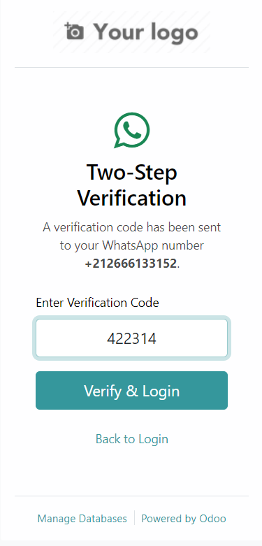
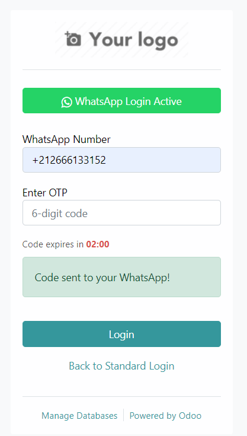
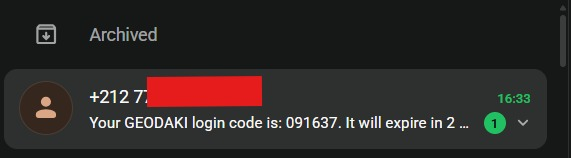

WhatsApp OTP Authentication
===========================

Présentation
------------

Ce module ajoute une option de connexion via OTP (mot de passe à usage unique) envoyé sur WhatsApp.
Il se greffe directement au formulaire de connexion standard d'Odoo et utilise l'API UltraMsg pour l'envoi du code.

Images de démonstration
-----------------------

Fonctionnement
--------------

Le module propose :

- un bouton "Login by WhatsApp" intégré au formulaire de connexion Odoo,
- la saisie du numéro WhatsApp au format international (`+212...`),
- l'envoi immédiat d'un code OTP sur WhatsApp,
- un champ de validation du code directement dans l'interface,
- une page de vérification 2FA si nécessaire pour renforcer la sécurité.

Pré-requis
----------

- Odoo 16 installé et accessible.
- Le module `web` actif.
- Un compte UltraMsg configuré pour l'envoi de messages WhatsApp.
- Accès internet depuis le serveur Odoo vers l'API UltraMsg.

Installation
------------

1. Copier le module `auth_whatsapp_otp` dans le répertoire des modules Odoo.
2. Mettre à jour la liste des modules depuis l'interface d'administration.
3. Installer le module `WhatsApp OTP Authentication`.

Configuration
-------------

- Si le module propose un menu de configuration, renseignez les clés API UltraMsg.
- Vérifiez que le numéro WhatsApp utilisé est autorisé par UltraMsg.
- Activez les options de test ou de production selon votre environnement.

Utilisation
-----------

- Ouvrez la page de connexion Odoo.
- Cliquez sur "Login by WhatsApp".
- Entrez votre numéro WhatsApp.
- Cliquez sur "Validate & Send Code".
- Recevez le code dans WhatsApp.
- Saisissez le code et cliquez sur "Login".

Résultat attendu
----------------

- L'utilisateur est redirigé vers le tableau de bord Odoo après validation.
- En cas d'erreur, un message détaillé apparaît dans le formulaire.

Points importants
-----------------

- Le code OTP expire après 2 minutes.
- Le bouton de retour permet de revenir au login standard.
- Les images de démonstration sont stockées dans `static/description/`.
- Le premier fichier d'image se terminant par `_screenshot.png` est utilisé comme capture principale.
